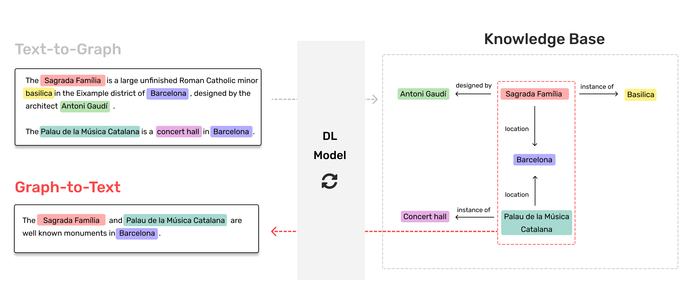

# GTWiki
**GTWiki** is a non-parallel dataset for **Text-To-Graph** (parsing) & **Graph-To-Text** (generation) tasks. It is used in the framework implemented in our paper: "A multi-task semi-supervised framework for Text2Graph & Graph2Text". 



### Non-parallel data

GTWiki can be used for **unsupervised learning**. The text and graphs are collected from the same entities (176,000) regarding Wikipedia and Wikidata. 

* *English text:* 240,024 instances (one sentence or more per each) of 459.67 characters of average length.
* *Graphs:* 271,095 instances (1 to 6 triples per each).

Data available at `data/monolingual.txt` and `data/graphs.txt` respectively.


### Collection 

Alternatively, you can run our collection script and customize it for your needs:

```shell
python3 collect.py [WIKIDATA_ID] [WIKIPEDIA_NAME] [MAX_DEPTH]
```

For example:

```
python3 collect.py Q762 "Leonardo da Vinci" 1
```

This execution will collect both, text and graphs, from [Leonardo da Vinci](https://en.wikipedia.org/wiki/Leonardo_da_Vinci) and [his children in the graph](https://query.wikidata.org/#PREFIX%20entity%3A%20%3Chttp%3A%2F%2Fwww.wikidata.org%2Fentity%2F%3E%0APREFIX%20property%3A%20%3Chttp%3A%2F%2Fwww.wikidata.org%2Fprop%2Fdirect%2F%3E%0ASELECT%20DISTINCT%20%3FsubjectLabel%20%3FpredicateLabel%20%3Fobject%20%3FobjectLabel%0AWHERE%0A%7B%0A%3Fproperty%20rdf%3Atype%20wikibase%3AProperty%20.%0A%3Fsubject%20%3Fpredicate%20%3Fobject.%0A%3Fproperty%20%3Fref%20%3Fpredicate.%0A%3Fproperty%20rdfs%3Alabel%20%3FpredicateLabel.%0A%3Fsubject%20rdfs%3Alabel%20%3FsubjectLabel.%0A%3Fobject%20rdfs%3Alabel%20%3FobjectLabel.%0AFILTER%20%28LANG%28%3FsubjectLabel%29%20%3D%20%27en%27%29.%0AFILTER%20%28LANG%28%3FpredicateLabel%29%20%3D%20%27en%27%29.%0AFILTER%20%28LANG%28%3FobjectLabel%29%20%3D%20%27en%27%29.%0AVALUES%28%3Fsubject%29%20%7B%28entity%3AQ762%29%7D%0A%7D). 

Please, for more information about the collection algorithm see our paper.


### Citation

If you find our work, data or the code useful, please consider to cite our paper.

